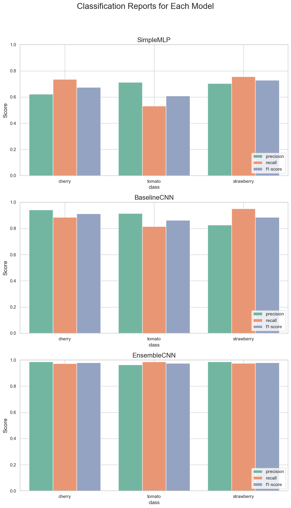

<a name="readme-top"></a>
[![Contributors][contributors-shield]][contributors-url]
[![Stargazers][stars-shield]][stars-url]
[![Issues][issues-shield]][issues-url]
[![LinkedIn][linkedin-shield]][linkedin-url]

<!-- PROJECT LOGO -->
<br />
<div align="center">
  <h3 align="center">Fruit Image Classifier</h3>

  <p align="center">
    A project that explores using Convolutional Neural Networks (CNNs) for classifying images of tomatoes, cherries, and strawberries.
    <br />
    <a href="https://github.com/yourusername/FruitImageClassifier"><strong>Explore the docs »</strong></a>
    <br />
    <br />
    <a href="https://github.com/yourusername/FruitImageClassifier/issues/new?labels=bug&template=bug-report---.md">Report Bug</a>
    ·
    <a href="https://github.com/yourusername/FruitImageClassifier/issues/new?labels=enhancement&template=feature-request---.md">Request Feature</a>
  </p>
</div>


<!-- ABOUT THE PROJECT -->
## About The Project

This project uses Convolutional Neural Networks (CNNs) for classifying images of tomatoes, cherries, and strawberries. It utilizes a dataset of 6,000 images and explores preprocessing and augmentation techniques to handle variations in lighting, angles, and background. Initial trials with an MLP yielded limited accuracy, while a custom CNN and a transfer-learning-based ResNet18 model significantly improved classification accuracy. The final ensemble model achieved 98% accuracy.

### Built With
* 
* 
* 
* 
* 
* 
* 

### Images





<embed src="./resources/shandbenj-report.pdf" width="600" height="400" type="application/pdf">

<!-- GETTING STARTED -->
## Getting Started

To get a local copy up and running, follow these steps.

### Prerequisites

* Python 3.8+
* PyTorch
* TorchVision

### Installation

1. Clone the repo
   ```sh
   git clone https://github.com/yourusername/FruitImageClassifier.git
   ```
2. Install the required packages
   ```sh
   pip install -r requirements.txt
   ```

<p align="right">(<a href="#readme-top">back to top</a>)</p>

<!-- USAGE EXAMPLES -->
## Usage

To train the model, run:
```sh
python train.py
```

This command will begin training with a preconfigured dataset and display training and validation metrics each epoch. 

<p align="right">(<a href="#readme-top">back to top</a>)</p>

<!-- ROADMAP -->
## Roadmap

- [ ] Optimise hyperparameters
- [ ] Implement advanced augmentations with generative models (GANs)

<p align="right">(<a href="#readme-top">back to top</a>)</p>

<!-- CONTRIBUTING -->
## Contributing

Contributions are welcome. Fork the repository, make your changes, and submit a pull request.

1. Fork the Project
2. Create a Feature Branch (`git checkout -b feature/AmazingFeature`)
3. Commit Your Changes (`git commit -m 'Add some AmazingFeature'`)
4. Push to the Branch (`git push origin feature/AmazingFeature`)
5. Open a Pull Request

<p align="right">(<a href="#readme-top">back to top</a>)</p>

<!-- LICENSE -->
## License

Distributed under the MIT License. See `LICENSE.txt` for more information.

<p align="right">(<a href="#readme-top">back to top</a>)</p>

<!-- CONTACT -->
## Contact

Ben Shand- [benjaminshand101@gmail.com](mailto:benjaminshand101@gmail.com)

<p align="right">(<a href="#readme-top">back to top</a>)</p>

<!-- ACKNOWLEDGMENTS -->
## Acknowledgments

* [PyTorch](https://pytorch.org/)
* [TorchVision](https://pytorch.org/vision/stable/index.html)

<p align="right">(<a href="#readme-top">back to top</a>)</p>


<!-- MARKDOWN LINKS & IMAGES -->
<!-- https://www.markdownguide.org/basic-syntax/#reference-style-links -->
[contributors-shield]: https://img.shields.io/github/contributors/Tokeley/Reel-It-In.svg?style=for-the-badge
[contributors-url]: https://github.com/Tokeley/Reel-It-In/graphs/contributors
[stars-shield]: https://img.shields.io/github/stars/Tokeley/Reel-It-In.svg?style=for-the-badge
[stars-url]: https://github.com/Tokeley/Reel-It-In/stargazers
[issues-shield]: https://img.shields.io/github/issues/Tokeley/Reel-It-In.svg?style=for-the-badge
[issues-url]: https://github.com/Tokeley/Reel-It-In/issues
[license-shield]: https://img.shields.io/github/license/Tokeley/Reel-It-In.svg?style=for-the-badge
[linkedin-shield]: https://img.shields.io/badge/-LinkedIn-black.svg?style=for-the-badge&logo=linkedin&colorB=555
[linkedin-url]:https://www.linkedin.com/in/benshand/
